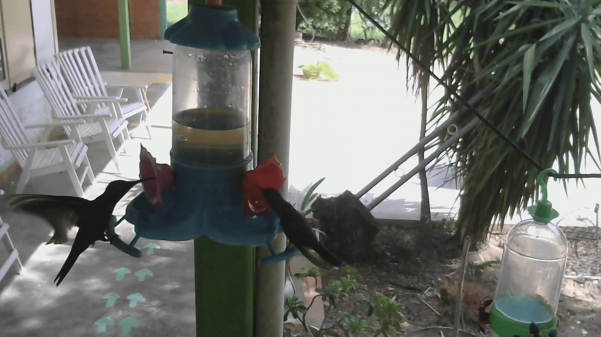

# Raspberry Pi Webcam Streaming

Steaming a Webcam from the Raspberry Pi to a Browser.

This project was tested on a Raspberry Pi 3 B+ with Raspbian GNU/Linux 9 (stretch) Lite and ffmpeg version 3.2.10.

## Setup

Log in to your Raspberry Pi

Install ffmpeg

```bash
sudo apt install ffmpeg
```

Obtain a copy of the code that will setup the stream

```bash
git clone https://github.com/danielwohlgemuth/rpi-webcam-stream.git
```

Navigate into the cloned repository

```bash
cd rpi-webcam-stream
```

Setup the stream

```bash
source setup.sh
```

Find out your Raspberry Pi's IP address 

```bash
hostname --all-ip-addresses
```

Access the **Raspberry Pi's IP Address** you got from the last command on **Port 8090** and append **/webcam** to see the stream.
Something like [http://RaspberryIPAddress:8090/webcam](http://RaspberryIPAddress:8090/webcam).

Note: At most 2 streams can be active at the same time with the current configuration. Increase **MaxBandwidth**, **MaxClients**, and **VideoBitRate** in `ffserver.conf` to increase this limit.

### Screenshot of the Webcam Stream



## Adapt or troubleshoot configuration

This project consist of 3 main files: `ffserver.conf`, `rpi-webcam-capture.service`, and `rpi-webcam-stream.service`.

By executing `setup.sh`, `ffserver.conf` is copied into `/etc/rpi-webcam-stream`, 
`rpi-webcam-capture.service` and `rpi-webcam-stream.service` are copied into `/etc/systemd/system/`.


### ffserver.conf

`ffserver.conf` contains the configuration for the stream.
Take a look at [https://www.ffmpeg.org/ffserver.html](https://www.ffmpeg.org/ffserver.html) if you'd like to make changes to it.

### rpi-webcam-stream.service

`rpi-webcam-stream.service` defines the background task responsible for streaming. It uses the configuration specified in `/etc/rpi-webcam-stream/ffserver.conf` for it.

This task also starts `rpi-webcam-capture.service`.

See if the task is running

```bash
systemctl status rpi-webcam-stream.service
```

See the complete log output

```bash
journalctl -u rpi-webcam-stream.service
```

### rpi-webcam-capture.service

`rpi-webcam-capture.service` defines the background task responsible for capturing the video content from the webcam. It uses [FFmpeg](https://www.ffmpeg.org/) to do this.

It is started by `rpi-webcam-stream.service`.

See if the task is running

```bash
systemctl status rpi-webcam-capture.service
```

See the complete log output

```bash
journalctl -u rpi-webcam-capture.service
```

## Video Troubleshooting

List available video devices

```bash
v4l2-ctl --list-devices
```

The output should look similar to this

```console
UVC Camera (046d:081b) (usb-3f980000.usb-1.1.3):
	/dev/video0
```

List available resolutions

```bash
ffmpeg -hide_banner -f v4l2 -list_formats all -i /dev/video0
```

The output should look similar to this

```console
[video4linux2,v4l2 @ 0xd6e5c0] Raw       :     yuyv422 :           YUYV 4:2:2 : 640x480 160x120 176x144 320x176 320x240 352x288 432x240 544x288 640x360 752x416 800x448 800x600 864x480 960x544 960x720 1024x576 1184x656 1280x720 1280x960
[video4linux2,v4l2 @ 0xd6e5c0] Compressed:       mjpeg :          Motion-JPEG : 640x480 160x120 176x144 320x176 320x240 352x288 432x240 544x288 640x360 752x416 800x448 800x600 864x480 960x544 960x720 1024x576 1184x656 1280x720 1280x960
/dev/video0: Immediate exit requested
```


Make a 15 seconds video recording

```bash
ffmpeg -hide_banner -thread_queue_size 512 -f v4l2 -i /dev/video0 -t 15 out.avi
```

## Audio Troubleshooting

List available audio devices

```bash
arecord -l
```

The output should look similar to this

```console
**** List of CAPTURE Hardware Devices ****
card 1: U0x46d0x81b [USB Device 0x46d:0x81b], device 0: USB Audio [USB Audio]
  Subdevices: 1/1
  Subdevice #0: subdevice #0
```

Notice the number following **card** and **device**. Those are used in the next command at hw:**card**,**device**

Make a 15 seconds sound recording.

```bash
ffmpeg -hide_banner -ac 1 -f alsa -i hw:1,0 -t 15 out.wav
```

## Capture Video and Audio together

```bash
ffmpeg -hide_banner -thread_queue_size 512 -ac 1 -f alsa -i hw:1,0 -f v4l2 -i /dev/video0 -t 15 out.avi
```
